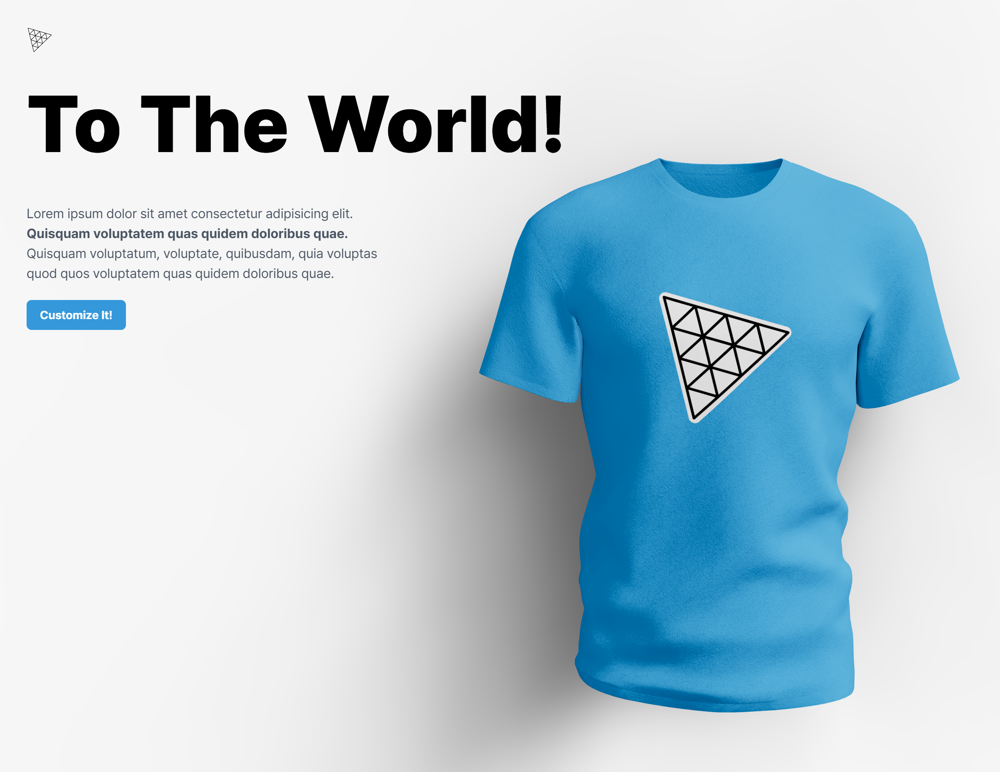
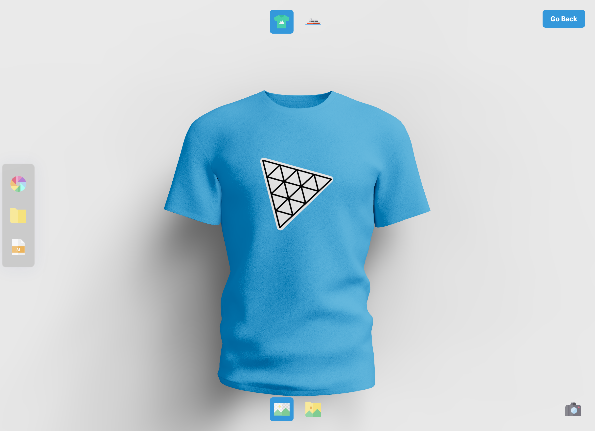
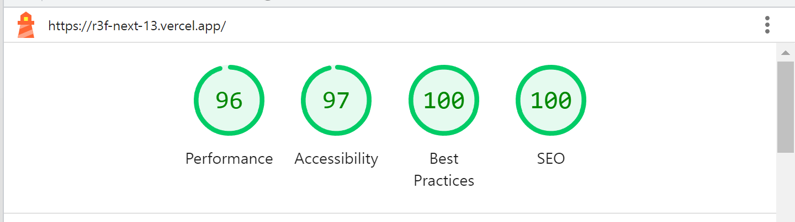

# Nexthree-Fiber

`Next.js@13` 과 `React-three/fiber` 를 이용한 3D 웹페이지 구현

## 🧩 데모
https://r3f-next-13.vercel.app/

## 🖼️ 스크린샷
### 메인
<!-- img tag -->

### 커스터마이징

## 🧱 기술 스택
- `TypeScript`
- [`Next.js@13/appDir`](https://nextjs.org/)
- [`TailwindCSS`](https://tailwindcss.com/)
- [`threejs`](https://threejs.org/)
- [`React-three/fiber(R3F)`](https://github.com/pmndrs/react-three-fiber)
- [`React-three/drei`](https://github.com/pmndrs/drei)
- [`gltfjsx`](https://github.com/pmndrs/gltfjsx)
- [`maath`](https://github.com/pmndrs/maath)
- [`framer-motion`](https://github.com/framer/motion)
- [`valtio`](https://github.com/pmndrs/valtio)
- [`openai-node`](https://github.com/openai/openai-node)
- [`pretendard`](https://github.com/orioncactus/pretendard)

## 📌 구현 기능
- `framer-motion` 을 통한 페이지 전환 애니메이션 및 UI 탭 애니메이션 구현
- `R3F` / `drei` / `maath`를 사용해 3D 모델링 및 렌더링 구현
- 마우스 커서 위치에 따른 모델 회전 구현
- 모델의 색상을 원하는 대로 변경 구현
- 모델에 부착하는 데칼을 'Logo' 또는 'Full' 텍스처로 변경 구현
- Open AI의 api key를 이용해 프롬프트를 입력하면 `🤖dalle`가 이미지를 생성해주고 데칼로 붙여주는 기능 구현
- 'Logo' 또는 'Full' 텍스처를 선택하면 해당 텍스처로 데칼을 붙여주는 기능 구현
- 캔버스 캡쳐 및 다운로드 기능 구현
- 모델 두 개(👕티셔츠, ⛵요트) 중 선택 가능
- 모델 로딩 화면 구현

## 🎸 기타
### 💯 Lighthouse Report

> 모델과 폰트 크기 때문에 조금은 낮게 나온 성적😔